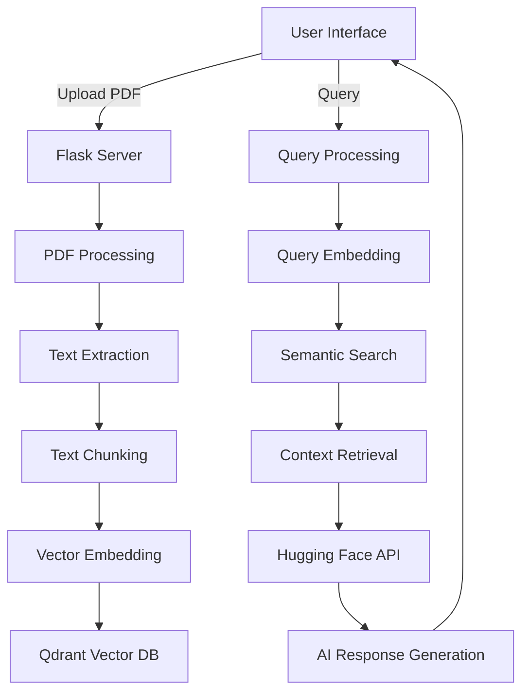

# PDF Insight Analyzer - AI-Powered Document Analysis

## Overview

**PDF Insight Analyzer is an advanced AI-powered application that transforms static PDF documents into interactive knowledge bases. Built with Python and Flask, this tool leverages Hugging Face's state-of-the-art language models and Qdrant's vector search capabilities to provide intelligent insights from your documents.**

### **Key capabilities:**

- **AI-Powered Q&A:** Ask natural language questions about your PDF content

- **Semantic Search:** Find relevant information using meaning-based search

- **Document Intelligence:** Extract and understand complex document structures

- **Knowledge Discovery:** Uncover hidden insights across multiple documents

## Features

### **Core Functionality**

- 📄 **PDF Upload & Processing:** Securely upload and process PDF documents

- 🔍 **Vector Embedding:** Convert text to semantic vectors for intelligent search

- 💬 **Natural Language Interaction:** Ask questions in plain English

- 🧠 **AI-Powered Insights:** Get accurate answers from document content

- 🗂️ **Document Management:** Organize and select documents from dropdown

### **Technical Highlights**

- **Advanced Vector Search:** Qdrant Cloud for efficient similarity search

- **State-of-the-Art AI:** Hugging Face Inference API with Mixtral 8x7B model

- **Modern Web Interface:** Responsive design with intuitive UX

- **Secure Architecture:** Local processing of sensitive documents

- **Scalable Backend:** Flask-based API ready for production deployment

## Technology Stack

### **Backend**

```text
| Component         | Technology                  | Purpose                                  |
|-------------------|-----------------------------|------------------------------------------|
| **Framework**     | Flask 3.0                   | Web application framework                |
| **AI Models**     | Hugging Face Inference API  | Natural language processing              |
| **Vector DB**     | Qdrant Cloud                | Semantic search and storage              |
| **Embeddings**    | SentenceTransformers        | Text to vector conversion                |
| **PDF Processing**| PyPDF2                      | Text extraction from PDFs                |
```

### **Frontend**

```text
| Component       | Technology          | Purpose                          |
|-----------------|---------------------|----------------------------------|
| **UI Framework**| HTML5/CSS3          | Application interface            |
| **Styling**     | CSS Animations      | Interactive user experience      |
| **Icons**       | Font Awesome 6      | Visual elements                  |
| **Layout**      | CSS Grid/Flexbox    | Responsive design                |
```

### **Project Structure**

```text
pdf-insight-app/
├── app.py                  # Main Flask application
├── config.py               # Configuration settings
├── requirements.txt        # Dependencies
├── README.md               # Documentation
├── .gitignore              # files and folders to ignore(not track)
├── utils/
│   ├── db_utils.py         # Qdrant database operations
│   ├── pdf_utils.py        # PDF processing functions
│   └── ai_utils.py         # hugging face API interactions
├── templates/
│   └── index.html          # Main UI template
└── static/
    └── style.css           # CSS styles
```

## Installation Guide

### **Prerequisites**

- Python 3.9+

- Pip package manager

- Free Hugging Face account (sign up)

- Qdrant Cloud account (sign up)

### **Step-by-Step Setup**

- 1. Clone the repository

```bash
git clone https://github.com/abuawaish/pdf-insight-analyzer.git
cd pdf-insight-analyzer
```

- 2. Create virtual environment

```bash
python -m venv venv
source venv/bin/activate  # Linux/Mac
venv\Scripts\activate    # Windows
```

- 3. Install dependencies

```bash
pip install -r requirements.txt
```

- 4. Configure environment variables
**Create `.env` file with your credentials:**

```bash
HF_API_KEY=your_hugging_face_api_token
QDRANT_URL=your_qdrant_cloud_url
QDRANT_API_KEY=your_qdrant_api_key
```

- 5. Initialize the application

```bash
python app.py
```

- 6. Access the application

** Open your browser to: http://localhost:5000**

## Usage Guide

### **Uploading Documents**

- Click "Browse Files" or drag-and-drop a PDF

- Select your PDF document

- Click "Process Document"

- Watch as the system extracts and indexes content

### **Asking Questions**

- Select your document from the dropdown

- Enter your question in natural language

- Click "Get Insights"

- Receive AI-generated answers based on document content

### **Example Queries**

- "What are the main findings in this report?"

- "Summarize the key points from section 3"

- "List all recommendations mentioned"

- "Explain the methodology used in this paper"

- "What dates are important in this document?"

## API Reference

### **Endpoints**

```text
| Endpoint     | Method | Description              | Parameters                                         |
|--------------|--------|--------------------------|----------------------------------------------------|
| `/`          | GET    | Main application UI      | None                                               |
| `/upload`    | POST   | Process PDF upload       | `pdf` (file)                                       |
| `/query`     | POST   | Handle document queries  | JSON: `{ "pdf_name": string, "query": string }`    |
```

### **Query Request Example**

```doctest
{
  "pdf_name": "annual-report-2023.pdf",
  "query": "What were the key financial metrics?"
}
```

### **Response Example**

```doctest
{
  "response": "The key financial metrics included a 15% YoY revenue growth..."
}
```

## System Architecture



